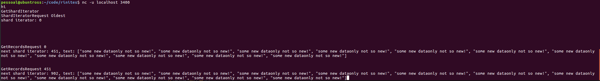

# RINITES

kinesis copy, to learn a bit about low level threading in rust

# Features

# TO DO
`in this todo: partition == file`
- [DONE] UDP server API. Request a shardIterator: oldest or latest.
- Tests. Don't know how to do them, since everything is IO and Rust does not let any race condition past it
- [DONE] create new partitions after they reach some size. This might need a lookup table or something to hold whats the next file
- I need some logic to index by timestamp or [DONE] sequencenumber like kinesis does. lookup table?
- Use an async runtime with async locks and a real http server (actix-web, probably)
- Delete old partitions

